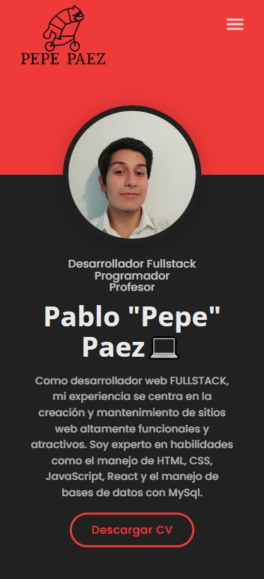

# Pablo Paez 💻
## Curriculum Personal - Programador, Desarrollador Web, Profesor
# 👇¡Live Test!👇
https://pablo-paez-curriculum.vercel.app

### Contacto📩

Pablo Paez - Desarrollador Web - pablopaez2307@gmail.com

[![LinkedIn][linkedin-shield]][linkedin-url]

 

  

# El proyecto😎

Este proyecto se creó ya que encontraba divertida la idea de poder crear un CV mas interactivo y que muestre mejor los proyectos que hice y me parecia coherente que al ser desarrollador web deberia tener mi propia pagina personal

### Tecnologias utilizadas:

Este proyecto utiliza como herramienta principal: 
[![React][React.js]][React-url]

Ademas de React, se utilizaron conocimientos en:

    -HTML
    -CSS
    -JAVASCRIPT
    -REACT
    -GIT KRAKEN
    -VERCEL HOSTING

# Version Mobile📱
Esta pagina web personal es compatible con dispositivos mobile!

  

# Instalacion

### Requisitos previos

Se recomienda tener la ultima version de npm para evitar errores:

  sh
  npm install npm@latest -g
  
* Gitbash/GitKraken o su software de preferencia y Visual Studio Code

### Clonar repositorio

1. Clonar el repositorio
   sh
   git clone https://github.com/Pepe2307/Curriculum_Page.git
   
   
2. Instalar paquetes NPM
Abrir dentro de Visual Studio Code la carpeta del repositorio clonado > darle click derecho a la misma > Abrir en terminal
   sh
   npm install
   
   
3. Inicializar proyecto

   js
   npm start
   

<!-- LINKS -->

[linkedin-shield]: https://img.shields.io/badge/-LinkedIn-black.svg?style=for-the-badge&logo=linkedin&colorB=555
[linkedin-url]: https://www.linkedin.com/in/pablo-paez-t/
[React.js]: https://img.shields.io/badge/React-20232A?style=for-the-badge&logo=react&logoColor=61DAFB
[React-url]: https://reactjs.org/
